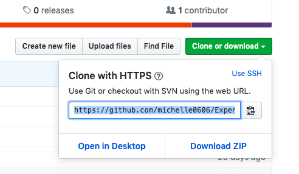
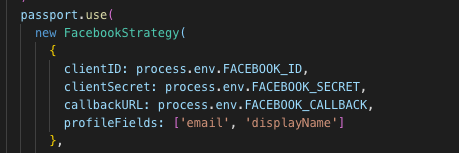

# Expense Tracker

This is a website build with express and MySQL, user can easily record their spend.

## Installing

- press "Clone or download" button to get the https URL



- type 'git clone' and paste the URL on terminal

```
$ git clone https://github.com/michelle0606/Expense-Tracker.git
```

- go into the project

```
$ cd expense-tracker-sequelize
```

- download npm

```
$ npm install
```

```
$ npm init -y
```

- go to https://developers.facebook.com/ , creating an app to get the clientID and clientSecret.
- open config/passport.js to set the clientID and clientSecret



- set the callbackURL to http://localhost:3000/auth/facebook/callback
- start the server

```
$ npm run start
```

- you can see this web on localhost:3000

### Prerequisites

This website is build with MySQL, make sure that you're already install it.

### Feature

- User can register/login
- User can see all records on home page
- User can filter records by month and category
- User can see the total amount
- User can create a new record list
- User can edit the detail of a record
- User can delete a record

## Built With

- [Express](https://expressjs.com/zh-tw/starter/installing.html)
- [Pug](https://pugjs.org/api/getting-started.html)
- [MySQL](https://www.mysql.com/)
- [Sequelize](http://docs.sequelizejs.com/)
